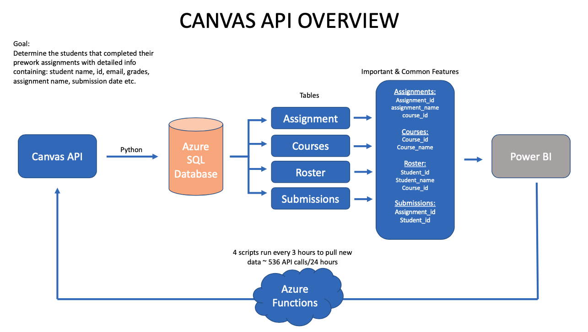

# Canvas_API_to_Azure_SQL_DB_Python

Leveraging canvas API with Python scripts hosted to extract list of courses (LC), list of students (LS), list of  assignments (LA) and list of submissions (LSub) information from the LMS based on a specified time interval, converting JSON responses to CSV format and writing them to Azure SQL database into four separate tables: Courses, Submissions, Assignments & Roster. The database created from Canvas API JSON responses have several features in common and can be used to create relations and determine new information. In this case, the goal is to determine the user, user email, course id, course name, assignment id, assignment name, grades of each assignment, submission time etc. and use this data to create data visualization in Power BI and Tableau. 

